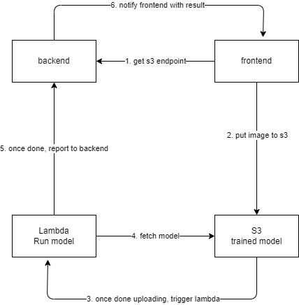

# telescope

## Architecture

## Frontend
react + tailwind + typescript + vite

steps:
1. install latest nodejs
2. npm install
3. change env variables in .env.development
4. npm run dev

## Backend
sqlc + pgsql + gin

steps:
1. install latest go
2. install sqlc
3. go mod tidy
4. change env variables in config.yaml
5. add aws credentials to env (or setup aws cli)
6. go run main.go

# Dev Journal
## 2025/01/28
Happy Chinese New Year!
- [x] add skeleton backend
- [x] add db
- [x] add docker for kafka

## 2025/01/29
- [x] add translations in backend, so all response can be translated based on user's language setting

## 2025/01/30
- [x] add translations in frontend
- [x] integrate zustand as state store
- [x] add frontend route guard

## 2025/01/31
- [x] config tailwind
tailwind 4 separated postcss to its own package, and old setup is not working anymore. After hours of struggle with v4, finally I switch back to tailwind v3 and everything is back to normal.

## 2025/02/01
- [x] add 404 page
- [x] add header nav bar

## 2025/02/03
- [x] setup lambda function, opencv&model layer and s3
Lessons learned:
You have to build you own layer which contains opencv and numpy if your lambda function required those packages. Also, you can include your model, assets, config file in that layer so those resources will be cached. If you use s3 to store those resources, then you will have to fetch it from s3 each time, which is more expensive and slower

TODO:
- [x] set up access control for s3 and lambda. One approach is use pre-signed url for frontend to upload image to s3.

## 2025/02/04
- [x] setup aws s3 presigned url
- [x] setup frontend camera

Lessons learned:
1. In go, time.Duration default is nano second (10&-9 second), so always remember to use like this
> nanoseconds := time.Duration(seconds) * time.Second
2. In chrome, you need to set the default camera equipment yourself. Otherwise it may trigger the default system one, and that one may be a dummy camera. So always remember to check the camera setting of chrome.
3. S3 presigned url can let frontend directly upload files to S3. While for lambda function, no such things, so better call lambda from backend or use lambda trigger. It's dangerous to expose a lambda function url to the public

## 2025/02/05
- [x] whole process worked locally

## 2025/02/06
- [x] fix frontend route reload nginx bug
- [x] fix frontend menu css
- [x] fix session

## TODO
- [] CI/CD
- [] add ssl
- [] SSE
- [] job queue